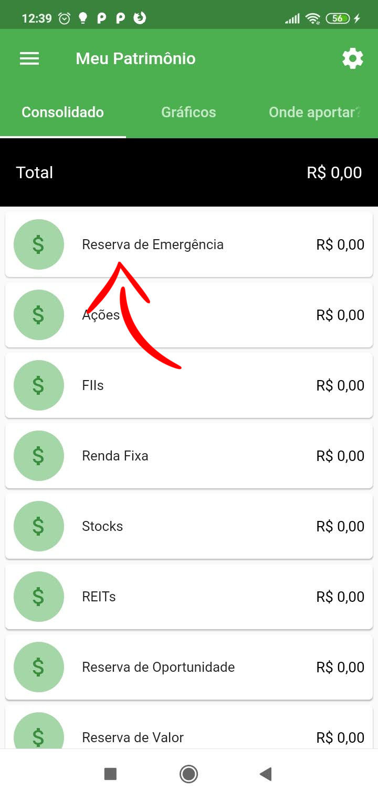
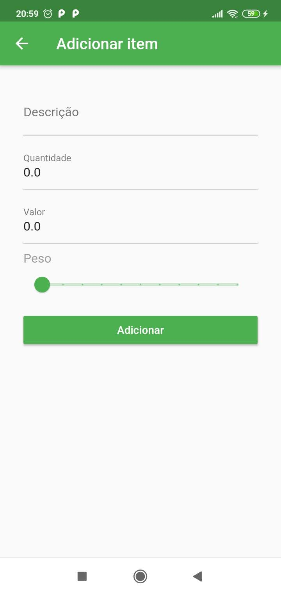

    

# Meu Patrimonio App

Simples aplicativo para registro e acompanhamento dos seus ativos financeiros. Foi desenvolvido como parte da avaliação da disciplina de Fundamentos de Programação Aplicada no PPGIA, UFRPE.

## Objetivo

O aplicativo Meu Patrimônio tem como objetivo auxiliar o usuário a monitorar seu patrimônio de ativos financeiros através de uma interface amigável. Além do monitoramento, o usuário também pode definir seus objetivos e identificar quais ativos necessitam de aportes naquele momento.

O foco do aplicativo não é ficar acompanhando cotação. O aplicativo busca justamente acabar com isso, reduzindo a ansiedade daqueles que acompanham o tempo todo seus ativos. Desta maneira, o usuário deve focar apenas em valor, definir seus objetivos, juntar bons ativos e alcançar os objetivos, com o foco no longo prazo.

## Tutorial de Uso

## Navegação

O aplicativo Meu Patrimônio é composto pelo seguinte fluxo de navegação:

## Telas

### Login e Cadastro

Nesta tela é possível alternar entre realizar o login no aplicativo ou criar o registro para os novos usuários. Além disso, é possível recuperar os dados de acesso informando o e-mail cadastrado.

    
    

### Meu Patrimônio

Esta é a tela principal do aplicativo. Composta de três abas que mostram os dados consolidados dos ativos financeiros.

Na primeira, chamada Consolidado, é possível listar as categorias dos ativos e os totais acumulados em cada uma. Na segunda, chamada Gráficos, é possível ver na forma de gráficos, a posição atual em cada categoria e qual seria sua posição ideal.

Finalizando, a última aba chamada Onde aportar, indica quanto falta percentualmente para que o usuário alcance os objetivos definidos em cada categoria de ativo.

    
    
    

Além disso, a tela principal dá acesso à configuração dos objetivos percentuais que o usuário deseja alcançar em cada tipo de ativo.

    
    

### Reservas (Emergência, Oportunidade e Valor)

Nesta tela o usuário poderá cadastrar ativos referentes a três tipos de reservas financeiras, a de Emergência, de Oportunidade e a de Valor.

O usuário poderá cadastrar uma descrição da reserva e o quanto ela vale atualmente. Abaixo, segue o exemplo do cadastro de uma Poupança como Reserva de Emergência.

    
    
    
    
    
    

### Ativos de Renda Variável (Ações, FIIs, Stocks e REITs)

Nesta tela o usuário poderá cadastrar os ativos de renda variável, informando o seu ticker identificador. Desta forma o aplicativo, obterá automaticamente seu valor e o salvará na ferramenta. É importante frizar que os tickers identificadores seguem o formato adotado pelo [Yahoo! Finance](https://finance.yahoo.com)

Abaixo, segue um exemplo de como cadastrar um ativo do tipo Ação.

    
    
    
    
    
    

Para atualizar as cotações, o usuário poderá tocar e arrastar listagem dos ativos para baixo. Assim, o aplicativo atualizará os valores de acordo com a cotação atual.

    

### Ativos de Renda Fixa (Tesouro Direto, CDB, LCI, LCA)

Nesta tela o usuário poderá cadastrar seus ativos de renda fixa. Estes ativos não poderão ser atualizados automaticamente, sendo necessário a atualização manual do usuário.

Abaixo, segue um exemplo de como cadastrar um ativo de Renda Fixa:

    
    
    
    
    
    

### Editando ou Excluindo ativos

Todos os ativos possuem a opção de editar ou removê-los. Basta tocar no item correspondente ao ativo para editar, ou na lixeira para excluir.

    
    
    

## Futuras melhorias

As funcionalidades do aplicativo ainda não limitadas, entretanto abaixo temos algumas melhorias que podem ser desenvolvidas em versões futuras:

- [ ] Importação dos ativos via CEI (Canal Eletrônico do Investidor).
- [ ] Identificação de eventos fracionários (split, inplit, bonificação, etc).
- [ ] Aviso de pagamento de dividendos, JCPs, rendimentos, bonificações, etc.